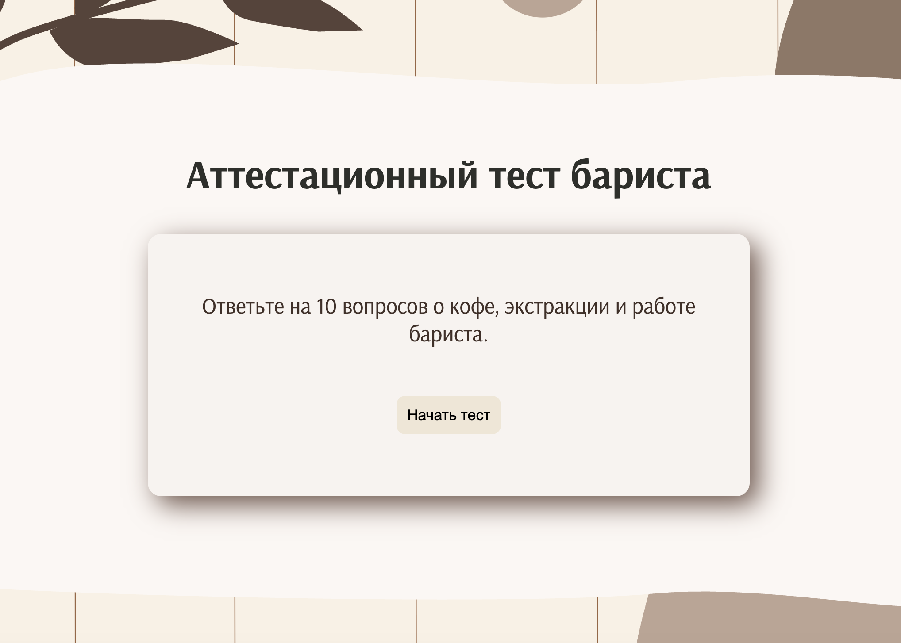
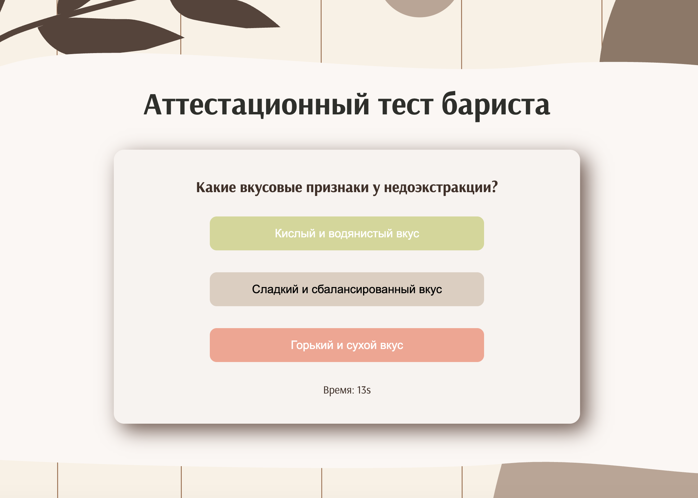
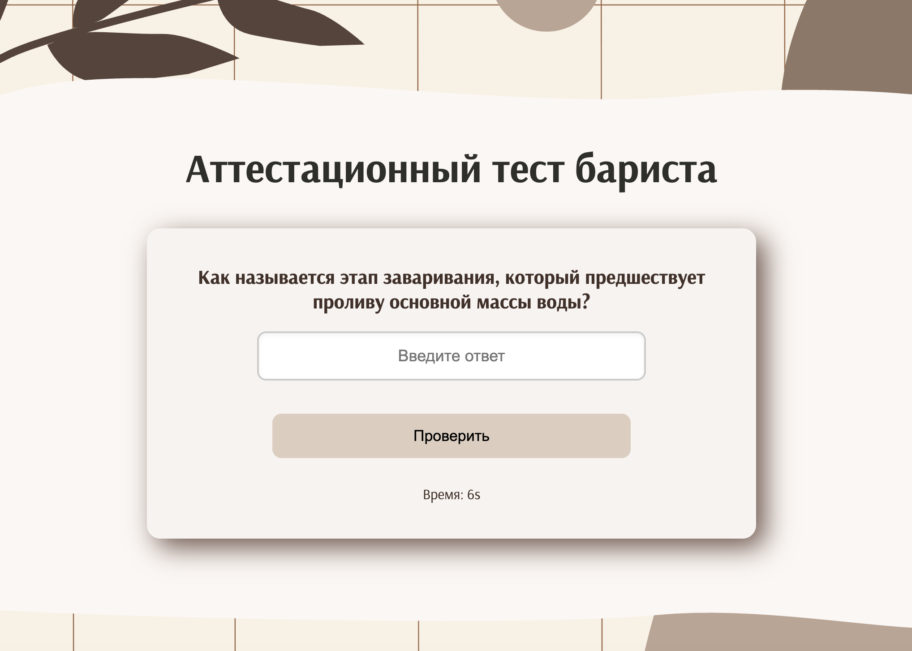
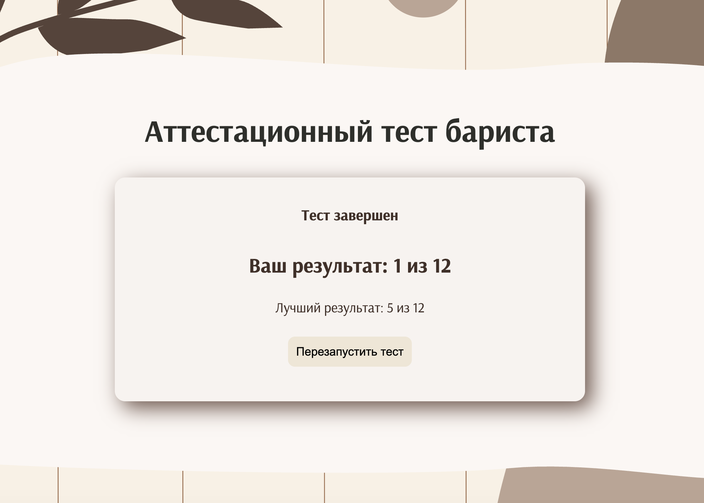

# ☕ Barista Quiz

Interactive coffee knowledge quiz built with Vanilla JavaScript.

The application tests knowledge of coffee, extraction and barista fundamentals using multiple-choice and text-based questions.

## 🌐 Live Demo

[View Live Demo](https://gipcha.github.io/barista-quiz/)

## ✨ Features

- Multiple-choice and text-based questions
- Answer validation with visual feedback
- Score calculation
- Best score tracking
- Countdown timer for questions
- Best result persistence using LocalStorage
- Dynamic question rendering
- Quiz restart functionality

## 🛠 Tech Stack

- HTML5
- CSS3
- JavaScript (ES6+)
- DOM API
- LocalStorage
- Git & GitHub

## 📸 Preview

### Start Screen



### Multiple-Choice Question



### Text Input Question



### Results



## ⚙️ Implementation

The quiz logic is implemented with Vanilla JavaScript.

Questions and answer controls are rendered dynamically using the DOM API. The application manages the current question, score and timer state, validates user answers and provides immediate visual feedback.

The best result is stored in LocalStorage, allowing it to persist between browser sessions.

## 🚀 Run Locally

Clone the repository:

```bash
git clone https://github.com/Gipcha/barista-quiz.git
```

Open the project directory:

```bash
cd barista-quiz
```

Then open `index.html` in your browser.
